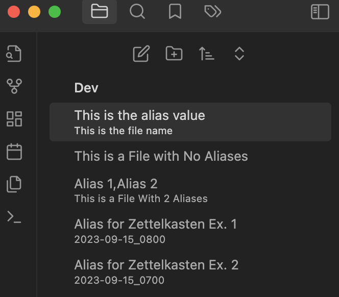
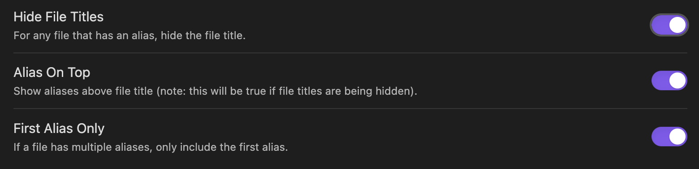

# Use Alias as File Title
### What does this plugin do?
This Obsidian plugin adds alias(es) defined in the file properties to the File Explorer.

### What problem does it solve?
This plugin allows Obsidian users to adopt [Zettelkasten](https://zettelkasten.de/) while also enjoying descriptive file titles in the File Explorer.

### What does it look like?

### Are there any configuration options?
Yes. As shown below, there are three configuration options.

### Credits
This plugin was inspired by [muhammadv-i](https://github.com/muhammadv-i)'s [obsidian-frontmatter-alias-display](https://github.com/muhammadv-i/obsidian-frontmatter-alias-display). 
